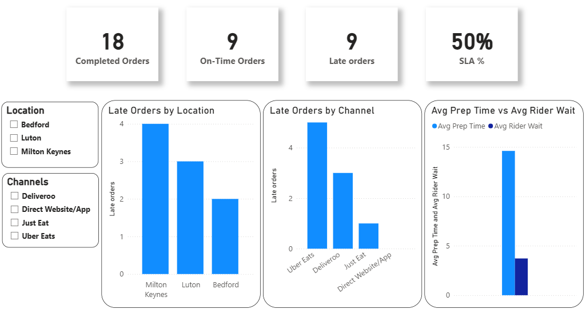
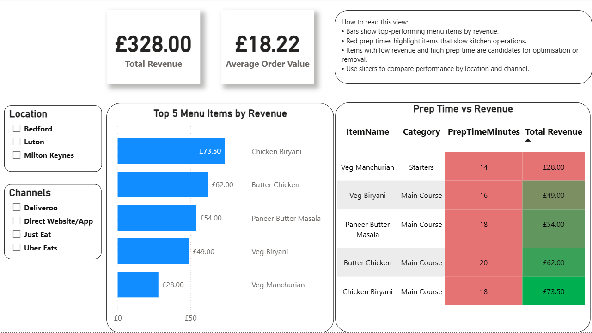
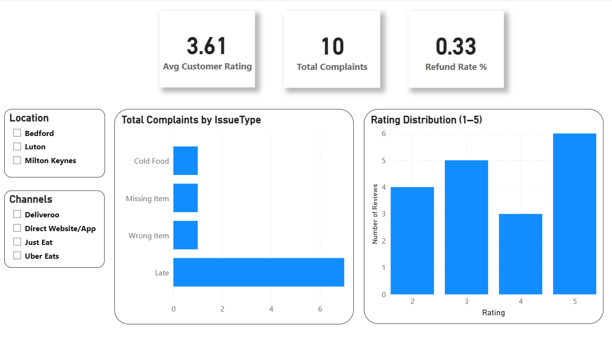

# Cloud Kitchen Analytics Dashboard (SQL & Power BI)

## 📌 Project Overview
This project analyses end-to-end operations of a multi-location cloud kitchen using SQL Server and Power BI.  
The goal is to help business owners and operations teams monitor delivery performance, menu efficiency, and customer experience, and make data-driven decisions.

The dashboard is designed as a **portfolio-ready analytics project**, following real-world BI practices.

---

## 🏢 Business Context
- **Locations:** Bedford, Milton Keynes, Luton  
- **Channels:** Uber Eats, Deliveroo, Just Eat, Direct Website/App  
- **Timeframe:** 90 days (sample data)

---

## 🎯 Business Objectives
- Improve **on-time delivery performance (SLA)**
- Identify **operational bottlenecks** (kitchen vs rider delays)
- Understand **menu item performance** (revenue vs prep time)
- Monitor **customer satisfaction, complaints, and refunds**

---

## 📊 Dashboard Structure

### 1️⃣ Executive Overview

- High-level KPIs: SLA %, total orders, average delivery time
- Order trends over time
- Performance comparison by location
- Interactive slicers for location and channel

### 2️⃣ Delivery SLA & Operations

- Completed, on-time, and late orders
- SLA % analysis
- Late orders by location and channel
- Kitchen prep time vs rider wait time analysis

### 3️⃣ Menu Performance

- Total revenue and average order value
- Top 5 menu items by revenue
- Item-level comparison of prep time vs revenue
- Identification of slow, low-performing menu items

### 4️⃣ Customer Experience & Quality

- Average customer rating
- Total complaints and refund rate
- Complaints by issue type
- Rating distribution analysis

---

## 🛠️ Tech Stack
- **SQL Server** – data modelling, table creation, queries
- **Power BI Desktop** – data modelling, DAX measures, dashboards
- **GitHub** – version control and project documentation

---

## 📂 Repository Structure
cloud-kitchen-analytics/
│
├── sql/
│ ├── 01_create_tables.sql
│ └── 02_insert_seed_data.sql
│
├── powerbi/
│ └── Cloud_Kitchen_Analytics.pbix
│
├── screenshots/
│ ├── executive_overview.png
│ ├── delivery_sla_operations.png
│ └── menu_performance.png
│ └── customer_experience_quality.png
│
└── README.md
---

## ✅ Key Skills Demonstrated
- Data modelling & relational design
- SQL querying and data preparation
- DAX measures and KPI creation
- Interactive dashboard design
- Business-focused data storytelling

---

## 📎 Notes
- Data used is **synthetic** and created for learning and portfolio purposes.
- The project focuses on **analytics thinking and BI best practices**, not just visuals.
